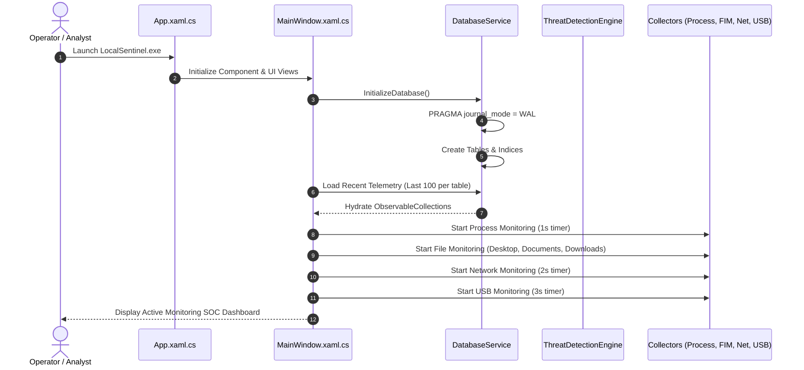
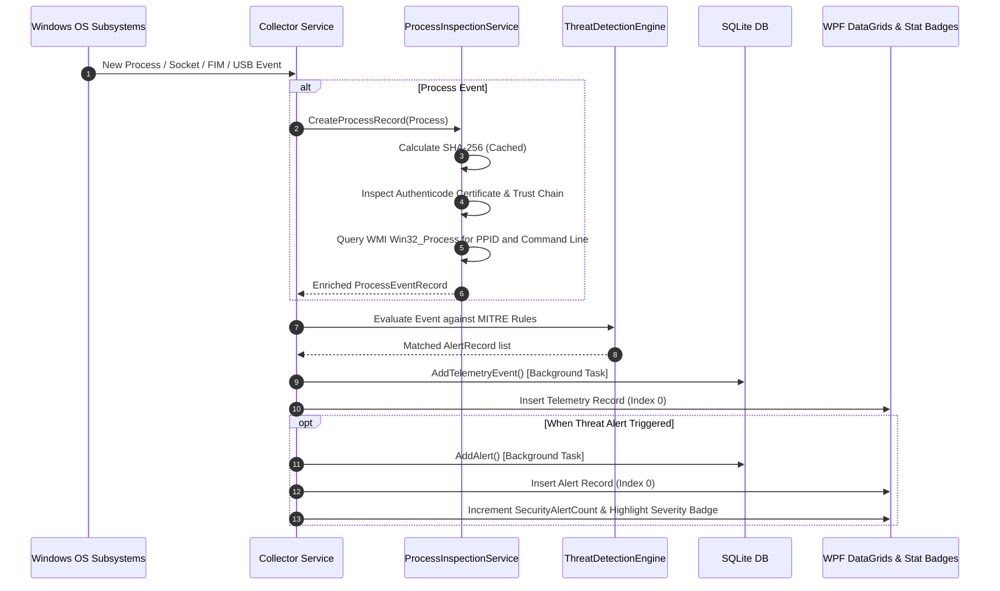
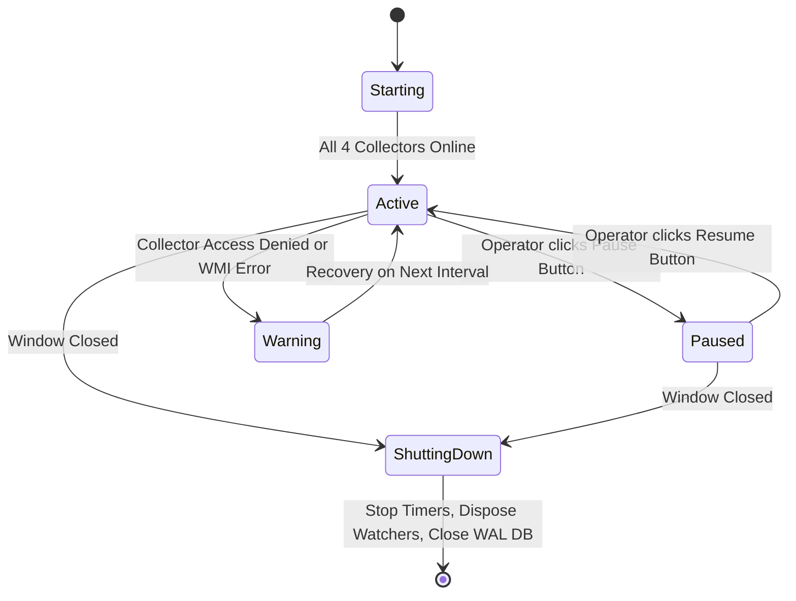

# Application Flow & State Management — LocalSentinel EDR v2.0

## 1. Startup & Initialization Flow

```mermaid
sequenceDiagram
    autonumber
    actor User as Operator / Analyst
    participant App as App.xaml.cs
    participant Win as MainWindow.xaml.cs
    participant DB as DatabaseService
    participant Engine as ThreatDetectionEngine
    participant Coll as Collectors (Process, FIM, Net, USB)

    User->>App: Launch LocalSentinel.exe
    App->>Win: Initialize Component & UI Views
    Win->>DB: InitializeDatabase()
    DB->>DB: PRAGMA journal_mode = WAL
    DB->>DB: Create Tables & Indices
    Win->>DB: Load Recent Telemetry (Last 100 per table)
    DB-->>Win: Hydrate ObservableCollections
    Win->>Coll: Start Process Monitoring (1s timer)
    Win->>Coll: Start File Monitoring (Desktop, Documents, Downloads)
    Win->>Coll: Start Network Monitoring (2s timer)
    Win->>Coll: Start USB Monitoring (3s timer)
    Win-->>User: Display Active Monitoring SOC Dashboard
```

## 2. Event Ingestion & Threat Detection Flow

```mermaid
sequenceDiagram
    autonumber
    participant System as Windows OS Subsystems
    participant Collector as Collector Service
    participant Insp as ProcessInspectionService
    participant Engine as ThreatDetectionEngine
    participant DB as SQLite DB
    participant UI as WPF DataGrids & Stat Badges

    System->>Collector: New Process / Socket / FIM / USB Event
    alt Process Event
        Collector->>Insp: CreateProcessRecord(Process)
        Insp->>Insp: Calculate SHA-256 (Cached)
        Insp->>Insp: Inspect Authenticode Certificate & Trust Chain
        Insp->>Insp: Query WMI Win32_Process for PPID and Command Line
        Insp-->>Collector: Enriched ProcessEventRecord
    end
    Collector->>Engine: Evaluate Event against MITRE Rules
    Engine-->>Collector: Matched AlertRecord list
    Collector->>DB: AddTelemetryEvent() [Background Task]
    Collector->>UI: Insert Telemetry Record (Index 0)
    opt When Threat Alert Triggered
        Collector->>DB: AddAlert() [Background Task]
        Collector->>UI: Insert Alert Record (Index 0)
        Collector->>UI: Increment SecurityAlertCount & Highlight Severity Badge
    end
```

## 3. Monitoring Control State Machine

```mermaid
stateDiagram-v2
    [*] --> Starting
    Starting --> Active: All 4 Collectors Online
    Active --> Paused: Operator clicks Pause Button
    Paused --> Active: Operator clicks Resume Button
    Active --> Warning: Collector Access Denied or WMI Error
    Warning --> Active: Recovery on Next Interval
    Active --> ShuttingDown: Window Closed
    Paused --> ShuttingDown: Window Closed
    ShuttingDown --> [*]: Stop Timers, Dispose Watchers, Close WAL DB
```
